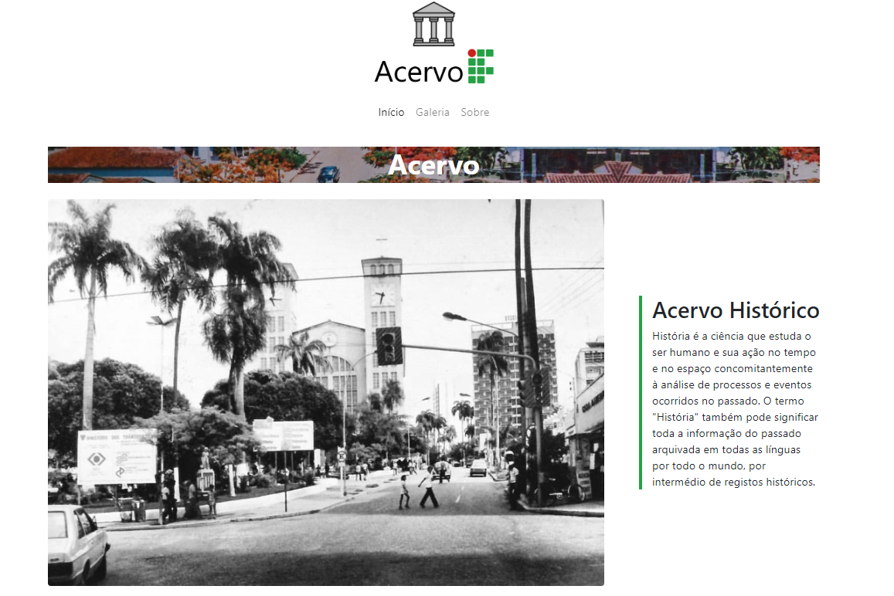
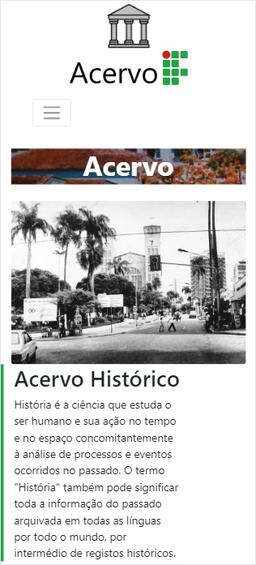

museu-ifmt
==========
Página estática com Bootstrap 4 e Parallax.js

## Sobre

O projeto é o trabalho final da disciplina de Web I, do curso superior de Sistemas para Internet, IFMT 2019

Foi feito em conjunto com @[MateusJellal](https://github.com/MateusJellal), colega de turma

## Página
[gustavo-lara.codes/museu-ifmt](https://gustavo-lara.codes/museu-ifmt/)

### Desktop

### Mobile

